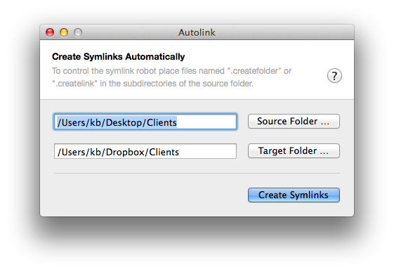
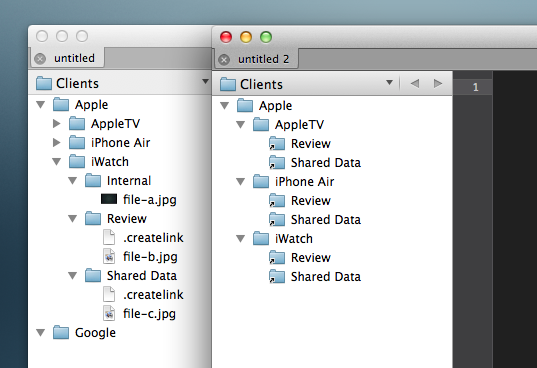

Autolink
========

An OS X Utility App to selectively mirror a file structure into another location - for example into your Dropbox. Selective synching is controlled via hidden files.

## Usage

You can only mirror folders. Files have to be in a folder you mirror via a symlink. You can control if you want to create a new folder at the target destination or an symbolic link with the hidden files `.createfolder` and `.createlink`.

If you choose to create a folder all direct subfolders will be scanned for hidden files so those subfolders can end up in the target folder as symlinks or folders to.

Here is an example of a project directory that is synched to a dropbox excluding the folder "Internal"

