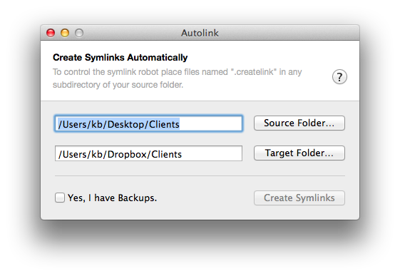

Autolink (Experimental Alpha)
=============================

An OS X Utility App to selectively mirror a file structure via symlinks and folders to another location - for example into your Dropbox. Selective syncing is controlled via hidden files.

## Usage

You can only mirror folders. Files have to be in a folder you mirror via a symlink. If you want to create a folder at the target destination or an symbolic link is controlled with the hidden files `.createfolder` and `.createlink`.

Why mirroring folders? You use folders to give the target folder more structure, because once you symlinked a folder there is no way to selectively sync inside this folder anymore.

If you choose to create a folder all direct subfolders will be scanned for hidden files so those subfolders can end up in the target folder as symlinks or folders to.

Here is an example of a project directory that is synched to a dropbox excluding the folder "Internal"

